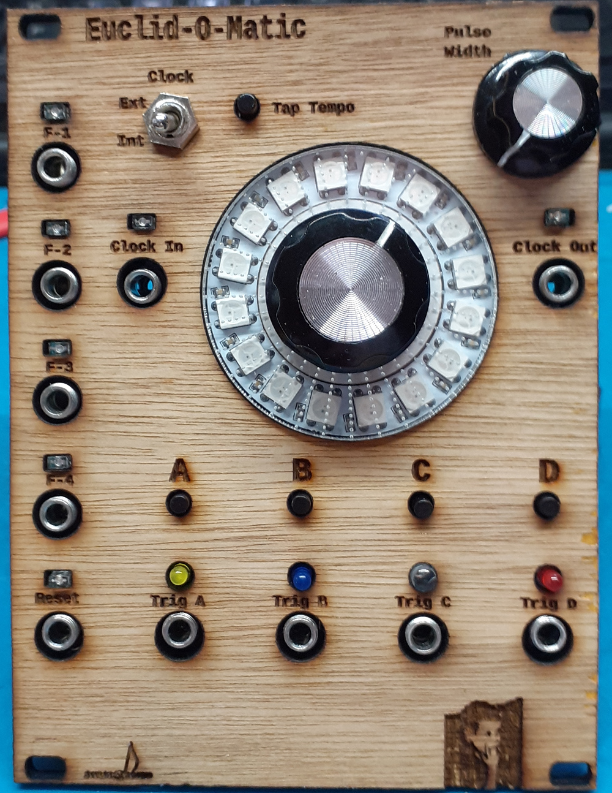

# Euclid-O-Matic

Sun Apr  3 15:01:35 CEST 2022

This project is based on a project called 'Euclidean Rhythm Generator Kosmo/Eurorack' 
published by L J Brackney, (Suncoast Polytechnical High School)
dated 11/21/2021. It saw it on instructible.com and liked it so much that I decide to make my own version of the module,
While doing so I changed the hardware and the software (quite) a bit. Work on this started
in January 2022.

Amongst others I added support for:

    external clock in and clock out,
    4 function CV inputs,
    variable pattern length,
    patch storage and recall,
    recall of settings on startup,
    a reset input.

Using the F-1 … F-4 CV inputs the patterns can be shifted stepwise.

In this implementation setting the speed depends on pressing the tap tempo button while turning
the rotary encoder. 
